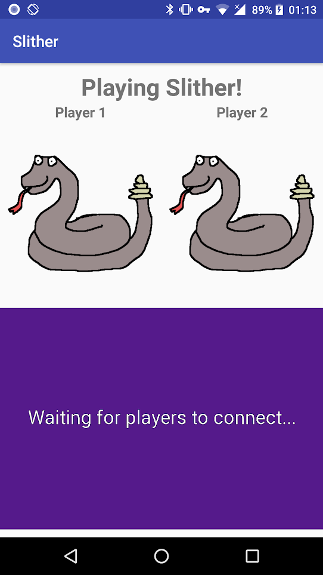

# microbit-slither

Multiplayer snake game. Controlled via bluetooth on micro:bits, and
hosted on an Android device.

The Android app is written in Kotlin, a programming language that is able to
compile down to the JVM. The micro:bit firmware is written in C++ using
micro:bit DAL.

## Building

Clone the repository:
`git clone git@gitlab.uwe.ac.uk:we2-randall/microbit-slither.git`

### Android

Download and install Android Studio:
https://developer.android.com/studio/index.html

Ensure the device you wish to install to is connected to your computer
via USB. The device must have developer mode enabled, which can be
achieved through following the Android guide:
https://developer.android.com/studio/debug/dev-options.html

Once developer mode is enabled, go to `Settings->Developer options` and
enable `USB Debugging`.

Within Android Studio, select:
`Open an existing Android Studio project`

Select the `android` folder within the cloned repository directory. Then
click the green run button on the second top menu bar of Android Studio.

*Note: If you do not wish to install the project via Android studio, the
APK file should be provided in the project located at
`android/slither.apk`. This may be installed on the device by simply
downloading it.*

### Micro:Bit

Modify `Makefile` in the `microbit/slither` directory of the project to
ensure the `MICROBIT_PATH` is set to where ever your micro:bit is
mounted.

In ArchLinux, this will be:

`/run/media/<username>/MICROBIT`

If attempting to run on the UWE machines, the micro:bit should be
mounted at:

`/media/student/MICROBIT`.

Once properly configured, you may build the project and copy the binary
onto both devices with the `make` command while in the
`microbit/slither` directory.

*Note: Both devices must be plugged in to do this. To install on a
       single plugged in device, use `make 0`*

## Usage

### Prerequisites

Two one android device and two micro:bit devices are required to play
this game. Ensure the micro:bit firmware, located in `microbit`, and the
Android app, located in `android`, are installed on their relative
devices.

### Running

The micro:bit devices should display the `SLITHER` scroll message to
indicate the firmware is installed. After the message has scrolled, the
micro:bit will indicate which direction the device is being tilted via
the LED display.

The Android app may be opened once installed on the device, the app
should be named `Slither`. Before opening the app, ensure location and
bluetooth are enabled to ensure bluetooth works correctly. As soon as
the app has been opened, it attempts to scan for players using micro:bit
devices. Before any micro:bits are found, the app should display both
players as disconnected via greyed out snakes, with a message
`Waiting for players to connect...`.

Once one player has been found, their avatar should light up. All
movements of the micro:bit device are rendered to their avatar.
The game starts once both players are connected. The bottom purple
screen in the app is where the snake game is played. Two snakes should
appear, with the same colour as their given avatar. Movements of the
micro:bit device steer the direction in which the snake moves, and they
may move faster by holding the B button down.

The objective of slither is to be the first to achieve 100 points.
Points may be achieved by eating food (worth 5 points) and killing
the opponent snake (worth 25 points). 10 points are deducted on death,
so try to stay alive!

Food is depicted by small yellow dots in the game, eat them by moving
the snake over them. Unlike the original game of snake, you may not die
by hitting your own tail or reaching the sides of the screen. The only
way to die is by hitting the tail of your opponent. Players may try to
cut each other off to gain an upper hand.

Movements over the map edge are translated to the opposite side of the
map, creating a world wrapping effect similar to the game 'Pac-Man'.

Players grow, giving them an upper hand in attacking. Eating grows
players by one segment, while killing an opponent grows players by five
segments. Death reverts players back to the starting size of three
segments. The maximum size players may grow to is twenty segments, which
is never long enough to fill a complete line in any direction on the
map.

Once a player has reached the score of 100, the game is complete. The
player to achieve the winning score is displayed on the screen. Also the
the total number of points both players achieved will be displayed just
below the winner. Both micro:bit devices will be notified whether they
have won or lost the match, then a message will scroll on their LED
screens.

After five seconds of displaying the game outcome, a new game will begin.
Both players points, locations and sizes will be reset and the game will
be ready to play from fresh.

## State Diagram

